```python
# This Python 3 environment comes with many helpful analytics libraries installed
# It is defined by the kaggle/python Docker image: https://github.com/kaggle/docker-python
# For example, here's several helpful packages to load

import numpy as np # linear algebra
import pandas as pd # data processing, CSV file I/O (e.g. pd.read_csv)

# Input data files are available in the read-only "../input/" directory
# For example, running this (by clicking run or pressing Shift+Enter) will list all files under the input directory

import os
for dirname, _, filenames in os.walk('/kaggle/input'):
    for filename in filenames:
        print(os.path.join(dirname, filename))

# You can write up to 20GB to the current directory (/kaggle/working/) that gets preserved as output when you create a version using "Save & Run All" 
# You can also write temporary files to /kaggle/temp/, but they won't be saved outside of the current session
```

    /kaggle/input/kidney-stone-prediction-based-on-urine-analysis/kindey stone urine analysis.csv
    /kaggle/input/playground-series-s3e12/sample_submission.csv
    /kaggle/input/playground-series-s3e12/train.csv
    /kaggle/input/playground-series-s3e12/test.csv


This notebook is created for the Playground Series 3- Episode 12. It uses the original and the synthetic dataset created from the same source
https://www.kaggle.com/datasets/vuppalaadithyasairam/kidney-stone-prediction-based-on-urine-analysis.

| Column name | Explanation |
| --- | --- |
specific gravity |  Density of urine contrast to water
pH | How acidic/basic the urine is
osmolarity | Molecule concentration
conductivity | Concentration of charged ions in the sample
urea concentration | Concentration of urea in milimoles/litre
calcium concentration | Concentration of calcium in milimoles/litre
target | Classification Label

I achieved 0.87600 as area under ROC Curve score, and became the top 12% in the competition with this notebook.


```python
import xgboost as xgb
import lightgbm as lgb
import optuna

import seaborn as sns
import matplotlib.pyplot as plt

from sklearn.model_selection import StratifiedKFold, train_test_split
from sklearn.metrics import roc_auc_score, roc_curve

```


<style type='text/css'>
.datatable table.frame { margin-bottom: 0; }
.datatable table.frame thead { border-bottom: none; }
.datatable table.frame tr.coltypes td {  color: #FFFFFF;  line-height: 6px;  padding: 0 0.5em;}
.datatable .bool    { background: #DDDD99; }
.datatable .object  { background: #565656; }
.datatable .int     { background: #5D9E5D; }
.datatable .float   { background: #4040CC; }
.datatable .str     { background: #CC4040; }
.datatable .time    { background: #40CC40; }
.datatable .row_index {  background: var(--jp-border-color3);  border-right: 1px solid var(--jp-border-color0);  color: var(--jp-ui-font-color3);  font-size: 9px;}
.datatable .frame tbody td { text-align: left; }
.datatable .frame tr.coltypes .row_index {  background: var(--jp-border-color0);}
.datatable th:nth-child(2) { padding-left: 12px; }
.datatable .hellipsis {  color: var(--jp-cell-editor-border-color);}
.datatable .vellipsis {  background: var(--jp-layout-color0);  color: var(--jp-cell-editor-border-color);}
.datatable .na {  color: var(--jp-cell-editor-border-color);  font-size: 80%;}
.datatable .sp {  opacity: 0.25;}
.datatable .footer { font-size: 9px; }
.datatable .frame_dimensions {  background: var(--jp-border-color3);  border-top: 1px solid var(--jp-border-color0);  color: var(--jp-ui-font-color3);  display: inline-block;  opacity: 0.6;  padding: 1px 10px 1px 5px;}
</style>


```python
train_ds = pd.read_csv('/kaggle/input/playground-series-s3e12/train.csv')
test_ds = pd.read_csv('/kaggle/input/playground-series-s3e12/test.csv')
orig_train_ds = pd.read_csv('/kaggle/input/playground-series-s3e12/train.csv')

train_ds.drop('id', axis = 1, inplace = True)
test_ds.drop('id', axis = 1, inplace=True)

training = pd.concat([train_ds, orig_train_ds])

X = training.drop(columns = ['target'],  axis =1)
y = training['target']
```

# EDA


```python
def show_stats(dataset):
    d_dsc = dataset.describe().T
    d_dsc['unique'] = dataset.nunique()
    d_dsc['unique_perc%'] = d_dsc['unique'] / len(dataset) * 100
    d_dsc['null'] = dataset.isna().sum()
    d_dsc["duplicated"] = dataset.duplicated().sum()
    d_dsc['type'] = dataset.dtypes 
    return d_dsc
```


```python
print("Stats of the Synthetic Training Dataset")
show_stats(train_ds)
```

    Stats of the Synthetic Training Dataset


<div>
<style scoped>
    .dataframe tbody tr th:only-of-type {
        vertical-align: middle;
    }

    .dataframe tbody tr th {
        vertical-align: top;
    }

    .dataframe thead th {
        text-align: right;
    }
</style>
<table border="1" class="dataframe">
  <thead>
    <tr style="text-align: right;">
      <th></th>
      <th>count</th>
      <th>mean</th>
      <th>std</th>
      <th>min</th>
      <th>25%</th>
      <th>50%</th>
      <th>75%</th>
      <th>max</th>
      <th>unique</th>
      <th>unique_perc%</th>
      <th>null</th>
      <th>duplicated</th>
      <th>type</th>
    </tr>
  </thead>
  <tbody>
    <tr>
      <th>gravity</th>
      <td>414.0</td>
      <td>1.017894</td>
      <td>0.006675</td>
      <td>1.005</td>
      <td>1.012</td>
      <td>1.018</td>
      <td>1.022</td>
      <td>1.04</td>
      <td>28</td>
      <td>6.763285</td>
      <td>0</td>
      <td>0</td>
      <td>float64</td>
    </tr>
    <tr>
      <th>ph</th>
      <td>414.0</td>
      <td>5.955459</td>
      <td>0.642260</td>
      <td>4.760</td>
      <td>5.530</td>
      <td>5.740</td>
      <td>6.280</td>
      <td>7.94</td>
      <td>71</td>
      <td>17.149758</td>
      <td>0</td>
      <td>0</td>
      <td>float64</td>
    </tr>
    <tr>
      <th>osmo</th>
      <td>414.0</td>
      <td>651.545894</td>
      <td>234.676567</td>
      <td>187.000</td>
      <td>455.250</td>
      <td>679.500</td>
      <td>840.000</td>
      <td>1236.00</td>
      <td>80</td>
      <td>19.323671</td>
      <td>0</td>
      <td>0</td>
      <td>int64</td>
    </tr>
    <tr>
      <th>cond</th>
      <td>414.0</td>
      <td>21.437923</td>
      <td>7.514750</td>
      <td>5.100</td>
      <td>15.500</td>
      <td>22.200</td>
      <td>27.600</td>
      <td>38.00</td>
      <td>65</td>
      <td>15.700483</td>
      <td>0</td>
      <td>0</td>
      <td>float64</td>
    </tr>
    <tr>
      <th>urea</th>
      <td>414.0</td>
      <td>278.657005</td>
      <td>136.442249</td>
      <td>10.000</td>
      <td>170.000</td>
      <td>277.000</td>
      <td>385.000</td>
      <td>620.00</td>
      <td>73</td>
      <td>17.632850</td>
      <td>0</td>
      <td>0</td>
      <td>int64</td>
    </tr>
    <tr>
      <th>calc</th>
      <td>414.0</td>
      <td>4.114638</td>
      <td>3.217641</td>
      <td>0.170</td>
      <td>1.450</td>
      <td>3.130</td>
      <td>6.630</td>
      <td>14.34</td>
      <td>85</td>
      <td>20.531401</td>
      <td>0</td>
      <td>0</td>
      <td>float64</td>
    </tr>
    <tr>
      <th>target</th>
      <td>414.0</td>
      <td>0.444444</td>
      <td>0.497505</td>
      <td>0.000</td>
      <td>0.000</td>
      <td>0.000</td>
      <td>1.000</td>
      <td>1.00</td>
      <td>2</td>
      <td>0.483092</td>
      <td>0</td>
      <td>0</td>
      <td>int64</td>
    </tr>
  </tbody>
</table>
</div>


```python
print("Stats of the Original Dataset")
show_stats(orig_train_ds)
```

    Stats of the Original Dataset


<div>
<style scoped>
    .dataframe tbody tr th:only-of-type {
        vertical-align: middle;
    }

    .dataframe tbody tr th {
        vertical-align: top;
    }

    .dataframe thead th {
        text-align: right;
    }
</style>
<table border="1" class="dataframe">
  <thead>
    <tr style="text-align: right;">
      <th></th>
      <th>count</th>
      <th>mean</th>
      <th>std</th>
      <th>min</th>
      <th>25%</th>
      <th>50%</th>
      <th>75%</th>
      <th>max</th>
      <th>unique</th>
      <th>unique_perc%</th>
      <th>null</th>
      <th>duplicated</th>
      <th>type</th>
    </tr>
  </thead>
  <tbody>
    <tr>
      <th>id</th>
      <td>414.0</td>
      <td>206.500000</td>
      <td>119.655756</td>
      <td>0.000</td>
      <td>103.250</td>
      <td>206.500</td>
      <td>309.750</td>
      <td>413.00</td>
      <td>414</td>
      <td>100.000000</td>
      <td>0</td>
      <td>0</td>
      <td>int64</td>
    </tr>
    <tr>
      <th>gravity</th>
      <td>414.0</td>
      <td>1.017894</td>
      <td>0.006675</td>
      <td>1.005</td>
      <td>1.012</td>
      <td>1.018</td>
      <td>1.022</td>
      <td>1.04</td>
      <td>28</td>
      <td>6.763285</td>
      <td>0</td>
      <td>0</td>
      <td>float64</td>
    </tr>
    <tr>
      <th>ph</th>
      <td>414.0</td>
      <td>5.955459</td>
      <td>0.642260</td>
      <td>4.760</td>
      <td>5.530</td>
      <td>5.740</td>
      <td>6.280</td>
      <td>7.94</td>
      <td>71</td>
      <td>17.149758</td>
      <td>0</td>
      <td>0</td>
      <td>float64</td>
    </tr>
    <tr>
      <th>osmo</th>
      <td>414.0</td>
      <td>651.545894</td>
      <td>234.676567</td>
      <td>187.000</td>
      <td>455.250</td>
      <td>679.500</td>
      <td>840.000</td>
      <td>1236.00</td>
      <td>80</td>
      <td>19.323671</td>
      <td>0</td>
      <td>0</td>
      <td>int64</td>
    </tr>
    <tr>
      <th>cond</th>
      <td>414.0</td>
      <td>21.437923</td>
      <td>7.514750</td>
      <td>5.100</td>
      <td>15.500</td>
      <td>22.200</td>
      <td>27.600</td>
      <td>38.00</td>
      <td>65</td>
      <td>15.700483</td>
      <td>0</td>
      <td>0</td>
      <td>float64</td>
    </tr>
    <tr>
      <th>urea</th>
      <td>414.0</td>
      <td>278.657005</td>
      <td>136.442249</td>
      <td>10.000</td>
      <td>170.000</td>
      <td>277.000</td>
      <td>385.000</td>
      <td>620.00</td>
      <td>73</td>
      <td>17.632850</td>
      <td>0</td>
      <td>0</td>
      <td>int64</td>
    </tr>
    <tr>
      <th>calc</th>
      <td>414.0</td>
      <td>4.114638</td>
      <td>3.217641</td>
      <td>0.170</td>
      <td>1.450</td>
      <td>3.130</td>
      <td>6.630</td>
      <td>14.34</td>
      <td>85</td>
      <td>20.531401</td>
      <td>0</td>
      <td>0</td>
      <td>float64</td>
    </tr>
    <tr>
      <th>target</th>
      <td>414.0</td>
      <td>0.444444</td>
      <td>0.497505</td>
      <td>0.000</td>
      <td>0.000</td>
      <td>0.000</td>
      <td>1.000</td>
      <td>1.00</td>
      <td>2</td>
      <td>0.483092</td>
      <td>0</td>
      <td>0</td>
      <td>int64</td>
    </tr>
  </tbody>
</table>
</div>


```python
print("Stats of the Test Dataset")
show_stats(test_ds)
```

    Stats of the Test Dataset


<div>
<style scoped>
    .dataframe tbody tr th:only-of-type {
        vertical-align: middle;
    }

    .dataframe tbody tr th {
        vertical-align: top;
    }

    .dataframe thead th {
        text-align: right;
    }
</style>
<table border="1" class="dataframe">
  <thead>
    <tr style="text-align: right;">
      <th></th>
      <th>count</th>
      <th>mean</th>
      <th>std</th>
      <th>min</th>
      <th>25%</th>
      <th>50%</th>
      <th>75%</th>
      <th>max</th>
      <th>unique</th>
      <th>unique_perc%</th>
      <th>null</th>
      <th>duplicated</th>
      <th>type</th>
    </tr>
  </thead>
  <tbody>
    <tr>
      <th>gravity</th>
      <td>276.0</td>
      <td>1.018330</td>
      <td>0.006569</td>
      <td>1.005</td>
      <td>1.0140</td>
      <td>1.019</td>
      <td>1.02325</td>
      <td>1.034</td>
      <td>27</td>
      <td>9.782609</td>
      <td>0</td>
      <td>0</td>
      <td>float64</td>
    </tr>
    <tr>
      <th>ph</th>
      <td>276.0</td>
      <td>5.939312</td>
      <td>0.607143</td>
      <td>4.900</td>
      <td>5.5300</td>
      <td>5.730</td>
      <td>6.21000</td>
      <td>7.940</td>
      <td>62</td>
      <td>22.463768</td>
      <td>0</td>
      <td>0</td>
      <td>float64</td>
    </tr>
    <tr>
      <th>osmo</th>
      <td>276.0</td>
      <td>654.891304</td>
      <td>236.361932</td>
      <td>187.000</td>
      <td>456.0000</td>
      <td>658.000</td>
      <td>843.25000</td>
      <td>1236.000</td>
      <td>75</td>
      <td>27.173913</td>
      <td>0</td>
      <td>0</td>
      <td>int64</td>
    </tr>
    <tr>
      <th>cond</th>
      <td>276.0</td>
      <td>21.886594</td>
      <td>7.346069</td>
      <td>5.100</td>
      <td>17.4000</td>
      <td>23.600</td>
      <td>27.60000</td>
      <td>38.000</td>
      <td>58</td>
      <td>21.014493</td>
      <td>0</td>
      <td>0</td>
      <td>float64</td>
    </tr>
    <tr>
      <th>urea</th>
      <td>276.0</td>
      <td>280.985507</td>
      <td>134.877856</td>
      <td>64.000</td>
      <td>168.5000</td>
      <td>282.000</td>
      <td>385.00000</td>
      <td>620.000</td>
      <td>71</td>
      <td>25.724638</td>
      <td>0</td>
      <td>0</td>
      <td>int64</td>
    </tr>
    <tr>
      <th>calc</th>
      <td>276.0</td>
      <td>4.076848</td>
      <td>3.088524</td>
      <td>0.170</td>
      <td>1.5275</td>
      <td>3.230</td>
      <td>5.54000</td>
      <td>14.340</td>
      <td>74</td>
      <td>26.811594</td>
      <td>0</td>
      <td>0</td>
      <td>float64</td>
    </tr>
  </tbody>
</table>
</div>


We can see that synthetic, original and test datasets, do not contain null or duplicated values. Both of the datasets have numerical columns. As far as we can see all columns have similar distributions over different datasets. And gravitiy column appears to have very few unique values.


```python
sns.pairplot(training, hue="target")
```


    <seaborn.axisgrid.PairGrid at 0x7377318dbf10>


    
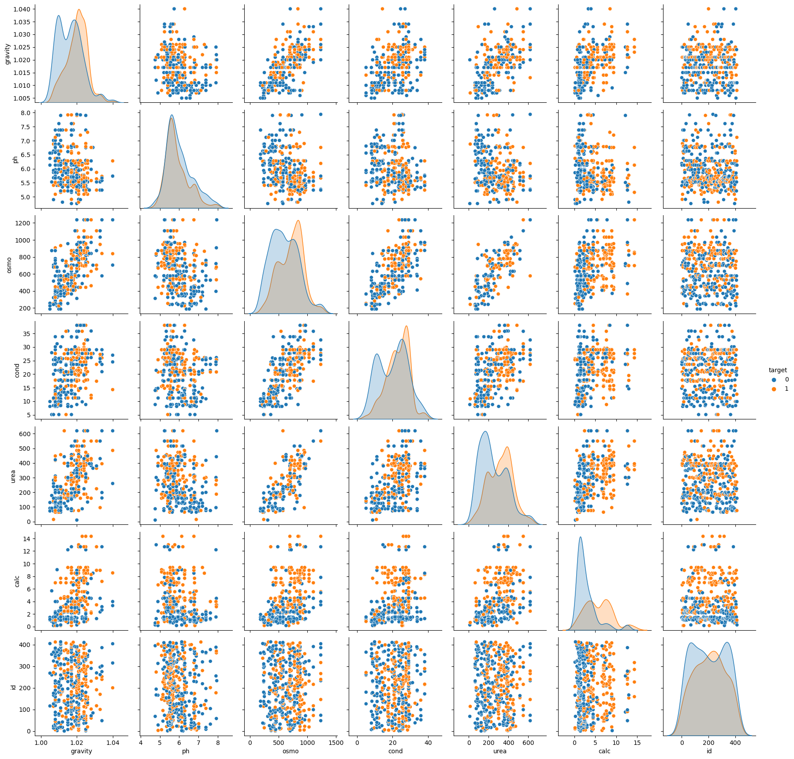
    


1. Calc separates target the most given the density functions, it could be the most important feature to predict presecne of kidney stones.
2. Osmo and gravity seem to have high positive correlation
3. Ph feature seem to have not much use to predict the presence of the stones, as prob. density func. seems too similar for both cases.


```python
corr = training.corr('pearson')
sns.heatmap(corr, mask=np.triu(np.ones_like(corr)), cmap=sns.diverging_palette(220, 10, as_cmap=True), annot = True,
            square=True, linewidths=.5, cbar_kws={"shrink": .5})

```


    <AxesSubplot:>


    
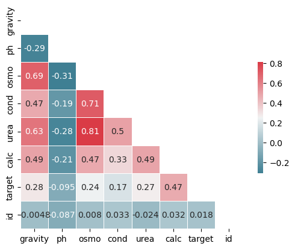
    


From the graph above, 
1. There is a high positive correlation between "osmo" and "urea" columns.
2. There is a moderate-high positive correlation between "osmo" and "cond" columns.
3. There is a moderate positive corelation between "urea" and "cond", also with "urea" and "calc" columns.
4. There is a moderate positive corelation between "urea" and "gravity" columns.
5. There is a moderate positive corelation between "calc" and "gravity" columns.


```python
def plot_distributions(data, columns, title):
    fig, ax = plt.subplots(3, 2, figsize = (10, 10), dpi = 100)
    ax = ax.flatten()
    for i, column in enumerate(columns):
        sns.kdeplot(data[column], ax=ax[i])    
        ax[i].set_title(f'{column} Distributions')
        ax[i].set_xlabel(None)

    fig.suptitle(title, fontsize = 24, fontweight = 'bold')
```


```python
plot_distributions(training, ['gravity', 'ph', 'osmo', 'cond', 'urea', 'calc'], 'Distribution of each Feature')
```


    
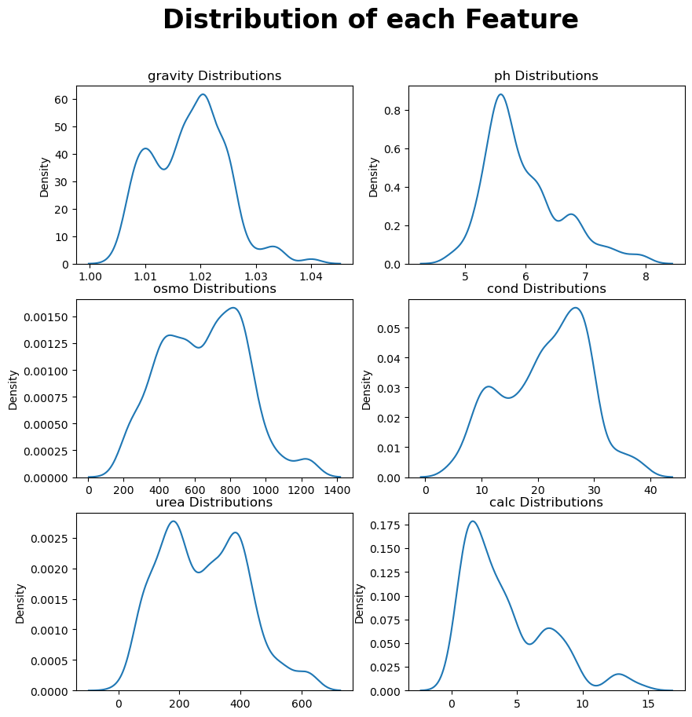
    


1. Distributions of "urea", "osmo",  in the above graph seems bimodal. We may need to transform them to the normal distribution before training.
2. Distributions of "gravity" and "cond" looks so similar.
3. Distributions of "ph" and "calc" looks so similar.
4. There may be some outliers in "calc" feature.


```python
labels = "True", "False"
ax = y.value_counts().plot.pie(y='target', title= 'Kidney Stone Presence in Training Data', labels=labels)
```


    
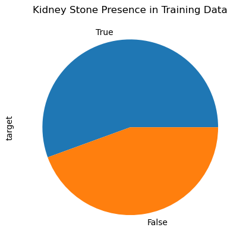
    


# PREPROCESSING


```python
columns = ['calc']
for col in columns:
    q_low = training[col].quantile(0.1)
    q_hi  = training[col].quantile(0.9)

cleaned_df = training[(training[col] < q_hi) & (training[col] > q_low)]
```


```python
plot_distributions(cleaned_df, ['gravity', 'ph', 'osmo', 'cond', 'urea', 'calc'], 'Distr. after outlier removal')
```


    
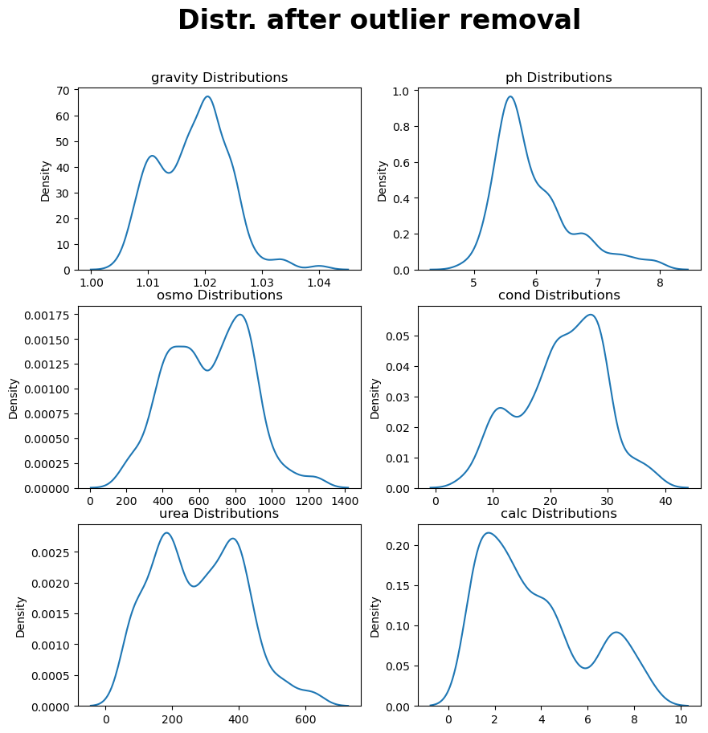
    


After removing the outliers, all of the distributions look slightly better as they are getting closer to a normal distribution.


```python
from sklearn.preprocessing import QuantileTransformer, RobustScaler, PowerTransformer

transformed_training = pd.DataFrame()
qt_columns = ['urea', 'osmo', 'gravity', 'calc' ]
pt_columns = ['ph', 'cond']

for i, column in enumerate(pt_columns):
    pt = PowerTransformer(method="yeo-johnson").fit_transform(cleaned_df[column].values.reshape(-1, 1))
    transformed_training[column] = pd.DataFrame(pt)
for i, column in enumerate(qt_columns):
    tf = QuantileTransformer().fit_transform(X=cleaned_df[column].values.reshape(-1, 1))
    transformed_training[column] = pd.DataFrame(tf)
    
for i, column in enumerate(pt_columns):
    pt = RobustScaler().fit_transform(cleaned_df[column].values.reshape(-1, 1))
    transformed_training[column] = pd.DataFrame(pt)
```

    /opt/conda/lib/python3.7/site-packages/sklearn/preprocessing/_data.py:2593: UserWarning: n_quantiles (1000) is greater than the total number of samples (660). n_quantiles is set to n_samples.
      "n_samples." % (self.n_quantiles, n_samples)
    /opt/conda/lib/python3.7/site-packages/sklearn/preprocessing/_data.py:2593: UserWarning: n_quantiles (1000) is greater than the total number of samples (660). n_quantiles is set to n_samples.
      "n_samples." % (self.n_quantiles, n_samples)
    /opt/conda/lib/python3.7/site-packages/sklearn/preprocessing/_data.py:2593: UserWarning: n_quantiles (1000) is greater than the total number of samples (660). n_quantiles is set to n_samples.
      "n_samples." % (self.n_quantiles, n_samples)
    /opt/conda/lib/python3.7/site-packages/sklearn/preprocessing/_data.py:2593: UserWarning: n_quantiles (1000) is greater than the total number of samples (660). n_quantiles is set to n_samples.
      "n_samples." % (self.n_quantiles, n_samples)


```python
plot_distributions(transformed_training, ['gravity', 'ph', 'osmo', 'cond', 'urea', 'calc'], 'Distr. after transformations')
```


    
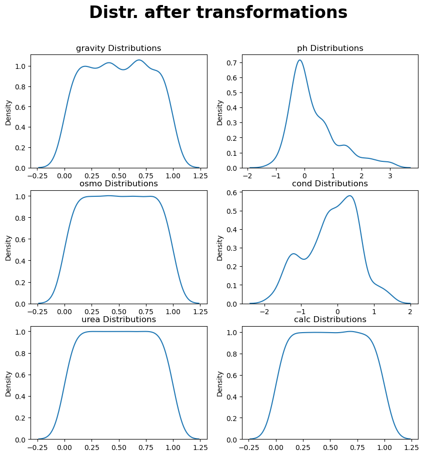
    


```python
X = transformed_training
y = cleaned_df['target']
```

# TRAINING


```python
def plot_eval_metrics(train_m, val_m, metric, title):
    plt.plot(train_m, label='train')
    plt.plot(val_m, label='validation')
    plt.ylabel(metric)
    plt.xlabel('Boosting round')
    plt.title(title)
    plt.legend()
    plt.show()
```

### LGBM H.PARAM TUNING


```python
# import optuna.integration.lightgbm as lgb
# from lightgbm import early_stopping
# from lightgbm import log_evaluation
# from sklearn.metrics import accuracy_score

# optuna.logging.disable_default_handler()

# def train(trial):
#     param = {
#         'objective': 'binary',
#         'metric': 'binary_logloss',
#         'lambda_l1': trial.suggest_loguniform('lambda_l1', 1e-8, 10.0),
#         'lambda_l2': trial.suggest_loguniform('lambda_l2', 1e-8, 10.0),
#         'num_leaves': trial.suggest_int('num_leaves', 2, 256),
#         'feature_fraction': trial.suggest_uniform('feature_fraction', 0.4, 1.0),
#         'learning_rate'   :trial.suggest_loguniform('lambda_l2', 1e-8, 1.0),
#         'bagging_fraction': trial.suggest_uniform('bagging_fraction', 0.4, 1.0),
#         'bagging_freq': trial.suggest_int('bagging_freq', 1, 7),
#         'min_child_samples': trial.suggest_int('min_child_samples', 5, 100),
#         'verbose': -1,
#         'feature_pre_filter' : False
#     }

#     skf = StratifiedKFold(n_splits=5, shuffle=True, random_state=42)
#     for fold_id, (train_idx, val_idx) in enumerate(skf.split(X, y)): 
#         X_train, X_val = X.iloc[train_idx], X.iloc[val_idx]
#         y_train, y_val = y.iloc[train_idx], y.iloc[val_idx]
#         dtrain = lgb.Dataset(X_train, label=y_train)
#         dval = lgb.Dataset(X_val, label=y_val)
#         lgb_model = lgb.train(param, dtrain, valid_sets=[dtrain, dval], verbose_eval=False,
#                     callbacks=[early_stopping(100), log_evaluation(100)])
#         preds = np.rint(lgb_model.predict(X_val, num_iteration=lgb_model.best_iteration))
#         accuracy = accuracy_score(y_val, preds)
#         return accuracy


# study_lgbm = optuna.create_study(direction="maximize")
# study_lgbm.optimize(train, n_trials=50)
```


```python
study_lgbm = {
    'best_params': {
        'lambda_l1': 7.444940822812977e-08,
        'lambda_l2': 1.5274601770345386,
        'num_leaves': 250,
        'feature_fraction': 0.4129928590439077,
        'bagging_fraction': 0.7062818831860239,
        'bagging_freq': 3,
        'min_child_samples': 89,
    }
}
```

### TRAIN LGBM


```python
import lightgbm as l_lgb
from lightgbm import early_stopping
from lightgbm import log_evaluation
from sklearn.metrics import accuracy_score

param = {
        'objective': 'binary',
        'metric': ["auc", 'binary_logloss'],
        **study_lgbm['best_params']
    }
evals_result = {}
skf = StratifiedKFold(n_splits=5, shuffle=True, random_state=42)
for fold_id, (train_idx, val_idx) in enumerate(skf.split(X, y)): 
    X_train, X_val = X.iloc[train_idx], X.iloc[val_idx]
    y_train, y_val = y.iloc[train_idx], y.iloc[val_idx]
    dtrain = l_lgb.Dataset(X_train, label=y_train)
    dval = l_lgb.Dataset(X_val, label=y_val)
    lgb_model = l_lgb.train(param, dtrain, valid_sets=[dtrain, dval], evals_result=evals_result, valid_names = ['validation', 'train'],
                callbacks=[early_stopping(100), log_evaluation(100)])
```

    /opt/conda/lib/python3.7/site-packages/lightgbm/engine.py:260: UserWarning: 'evals_result' argument is deprecated and will be removed in a future release of LightGBM. Pass 'record_evaluation()' callback via 'callbacks' argument instead.
      _log_warning("'evals_result' argument is deprecated and will be removed in a future release of LightGBM. "


    [LightGBM] [Info] Number of positive: 224, number of negative: 304
    [LightGBM] [Warning] Auto-choosing col-wise multi-threading, the overhead of testing was 0.001195 seconds.
    You can set `force_col_wise=true` to remove the overhead.
    [LightGBM] [Info] Total Bins 307
    [LightGBM] [Info] Number of data points in the train set: 528, number of used features: 6
    [LightGBM] [Info] [binary:BoostFromScore]: pavg=0.424242 -> initscore=-0.305382
    [LightGBM] [Info] Start training from score -0.305382
    [LightGBM] [Warning] No further splits with positive gain, best gain: -inf
    Training until validation scores don't improve for 100 rounds
    [LightGBM] [Warning] No further splits with positive gain, best gain: -inf
    [LightGBM] [Warning] No further splits with positive gain, best gain: -inf
    [LightGBM] [Warning] No further splits with positive gain, best gain: -inf
    [LightGBM] [Warning] No further splits with positive gain, best gain: -inf
    [LightGBM] [Warning] No further splits with positive gain, best gain: -inf
    [LightGBM] [Warning] No further splits with positive gain, best gain: -inf
    [LightGBM] [Warning] No further splits with positive gain, best gain: -inf
    [LightGBM] [Warning] No further splits with positive gain, best gain: -inf
    [LightGBM] [Warning] No further splits with positive gain, best gain: -inf
    [LightGBM] [Warning] No further splits with positive gain, best gain: -inf
    [LightGBM] [Warning] No further splits with positive gain, best gain: -inf
    [LightGBM] [Warning] No further splits with positive gain, best gain: -inf
    [LightGBM] [Warning] No further splits with positive gain, best gain: -inf
    [LightGBM] [Warning] No further splits with positive gain, best gain: -inf
    [LightGBM] [Warning] No further splits with positive gain, best gain: -inf
    [LightGBM] [Warning] No further splits with positive gain, best gain: -inf
    [LightGBM] [Warning] No further splits with positive gain, best gain: -inf
    [LightGBM] [Warning] No further splits with positive gain, best gain: -inf
    [LightGBM] [Warning] No further splits with positive gain, best gain: -inf
    [LightGBM] [Warning] No further splits with positive gain, best gain: -inf
    [LightGBM] [Warning] No further splits with positive gain, best gain: -inf
    [LightGBM] [Warning] No further splits with positive gain, best gain: -inf
    [LightGBM] [Warning] No further splits with positive gain, best gain: -inf
    [LightGBM] [Warning] No further splits with positive gain, best gain: -inf
    [LightGBM] [Warning] No further splits with positive gain, best gain: -inf
    [LightGBM] [Warning] No further splits with positive gain, best gain: -inf
    [LightGBM] [Warning] No further splits with positive gain, best gain: -inf
    [LightGBM] [Warning] No further splits with positive gain, best gain: -inf
    [LightGBM] [Warning] No further splits with positive gain, best gain: -inf
    [LightGBM] [Warning] No further splits with positive gain, best gain: -inf
    [LightGBM] [Warning] No further splits with positive gain, best gain: -inf
    [LightGBM] [Warning] No further splits with positive gain, best gain: -inf
    [LightGBM] [Warning] No further splits with positive gain, best gain: -inf
    [LightGBM] [Warning] No further splits with positive gain, best gain: -inf
    [LightGBM] [Warning] No further splits with positive gain, best gain: -inf
    [LightGBM] [Warning] No further splits with positive gain, best gain: -inf
    [LightGBM] [Warning] No further splits with positive gain, best gain: -inf
    [LightGBM] [Warning] No further splits with positive gain, best gain: -inf
    [LightGBM] [Warning] No further splits with positive gain, best gain: -inf
    [LightGBM] [Warning] No further splits with positive gain, best gain: -inf
    [LightGBM] [Warning] No further splits with positive gain, best gain: -inf
    [LightGBM] [Warning] No further splits with positive gain, best gain: -inf
    [LightGBM] [Warning] No further splits with positive gain, best gain: -inf
    [LightGBM] [Warning] No further splits with positive gain, best gain: -inf
    [LightGBM] [Warning] No further splits with positive gain, best gain: -inf
    [LightGBM] [Warning] No further splits with positive gain, best gain: -inf
    [LightGBM] [Warning] No further splits with positive gain, best gain: -inf
    [LightGBM] [Warning] No further splits with positive gain, best gain: -inf
    [LightGBM] [Warning] No further splits with positive gain, best gain: -inf
    [LightGBM] [Warning] No further splits with positive gain, best gain: -inf
    [LightGBM] [Warning] No further splits with positive gain, best gain: -inf
    [LightGBM] [Warning] No further splits with positive gain, best gain: -inf
    [LightGBM] [Warning] No further splits with positive gain, best gain: -inf
    [LightGBM] [Warning] No further splits with positive gain, best gain: -inf
    [LightGBM] [Warning] No further splits with positive gain, best gain: -inf
    [LightGBM] [Warning] No further splits with positive gain, best gain: -inf
    [LightGBM] [Warning] No further splits with positive gain, best gain: -inf
    [LightGBM] [Warning] No further splits with positive gain, best gain: -inf
    [LightGBM] [Warning] No further splits with positive gain, best gain: -inf
    [LightGBM] [Warning] No further splits with positive gain, best gain: -inf
    [LightGBM] [Warning] No further splits with positive gain, best gain: -inf
    [LightGBM] [Warning] No further splits with positive gain, best gain: -inf
    [LightGBM] [Warning] No further splits with positive gain, best gain: -inf
    [LightGBM] [Warning] No further splits with positive gain, best gain: -inf
    [LightGBM] [Warning] No further splits with positive gain, best gain: -inf
    [LightGBM] [Warning] No further splits with positive gain, best gain: -inf
    [LightGBM] [Warning] No further splits with positive gain, best gain: -inf
    [LightGBM] [Warning] No further splits with positive gain, best gain: -inf
    [LightGBM] [Warning] No further splits with positive gain, best gain: -inf
    [LightGBM] [Warning] No further splits with positive gain, best gain: -inf
    [LightGBM] [Warning] No further splits with positive gain, best gain: -inf
    [LightGBM] [Warning] No further splits with positive gain, best gain: -inf
    [LightGBM] [Warning] No further splits with positive gain, best gain: -inf
    [LightGBM] [Warning] No further splits with positive gain, best gain: -inf
    [LightGBM] [Warning] No further splits with positive gain, best gain: -inf
    [LightGBM] [Warning] No further splits with positive gain, best gain: -inf
    [LightGBM] [Warning] No further splits with positive gain, best gain: -inf
    [LightGBM] [Warning] No further splits with positive gain, best gain: -inf
    [LightGBM] [Warning] No further splits with positive gain, best gain: -inf
    [LightGBM] [Warning] No further splits with positive gain, best gain: -inf
    [LightGBM] [Warning] No further splits with positive gain, best gain: -inf
    [LightGBM] [Warning] No further splits with positive gain, best gain: -inf
    [LightGBM] [Warning] No further splits with positive gain, best gain: -inf
    [LightGBM] [Warning] No further splits with positive gain, best gain: -inf
    [LightGBM] [Warning] No further splits with positive gain, best gain: -inf
    [LightGBM] [Warning] No further splits with positive gain, best gain: -inf
    [LightGBM] [Warning] No further splits with positive gain, best gain: -inf
    [LightGBM] [Warning] No further splits with positive gain, best gain: -inf
    [LightGBM] [Warning] No further splits with positive gain, best gain: -inf
    [LightGBM] [Warning] No further splits with positive gain, best gain: -inf
    [LightGBM] [Warning] No further splits with positive gain, best gain: -inf
    [LightGBM] [Warning] No further splits with positive gain, best gain: -inf
    [LightGBM] [Warning] No further splits with positive gain, best gain: -inf
    [LightGBM] [Warning] No further splits with positive gain, best gain: -inf
    [LightGBM] [Warning] No further splits with positive gain, best gain: -inf
    [LightGBM] [Warning] No further splits with positive gain, best gain: -inf
    [LightGBM] [Warning] No further splits with positive gain, best gain: -inf
    [LightGBM] [Warning] No further splits with positive gain, best gain: -inf
    [LightGBM] [Warning] No further splits with positive gain, best gain: -inf
    [100]	validation's auc: 0.87525	validation's binary_logloss: 0.46163	train's auc: 0.792998	train's binary_logloss: 0.544046
    Did not meet early stopping. Best iteration is:
    [97]	validation's auc: 0.875441	validation's binary_logloss: 0.464246	train's auc: 0.791823	train's binary_logloss: 0.547651
    [LightGBM] [Info] Number of positive: 224, number of negative: 304
    [LightGBM] [Warning] Auto-choosing col-wise multi-threading, the overhead of testing was 0.001118 seconds.
    You can set `force_col_wise=true` to remove the overhead.
    [LightGBM] [Info] Total Bins 305
    [LightGBM] [Info] Number of data points in the train set: 528, number of used features: 6
    [LightGBM] [Info] [binary:BoostFromScore]: pavg=0.424242 -> initscore=-0.305382
    [LightGBM] [Info] Start training from score -0.305382
    [LightGBM] [Warning] No further splits with positive gain, best gain: -inf
    Training until validation scores don't improve for 100 rounds
    [LightGBM] [Warning] No further splits with positive gain, best gain: -inf
    [LightGBM] [Warning] No further splits with positive gain, best gain: -inf
    [LightGBM] [Warning] No further splits with positive gain, best gain: -inf
    [LightGBM] [Warning] No further splits with positive gain, best gain: -inf
    [LightGBM] [Warning] No further splits with positive gain, best gain: -inf
    [LightGBM] [Warning] No further splits with positive gain, best gain: -inf
    [LightGBM] [Warning] No further splits with positive gain, best gain: -inf
    [LightGBM] [Warning] No further splits with positive gain, best gain: -inf
    [LightGBM] [Warning] No further splits with positive gain, best gain: -inf
    [LightGBM] [Warning] No further splits with positive gain, best gain: -inf
    [LightGBM] [Warning] No further splits with positive gain, best gain: -inf
    [LightGBM] [Warning] No further splits with positive gain, best gain: -inf
    [LightGBM] [Warning] No further splits with positive gain, best gain: -inf
    [LightGBM] [Warning] No further splits with positive gain, best gain: -inf
    [LightGBM] [Warning] No further splits with positive gain, best gain: -inf
    [LightGBM] [Warning] No further splits with positive gain, best gain: -inf
    [LightGBM] [Warning] No further splits with positive gain, best gain: -inf
    [LightGBM] [Warning] No further splits with positive gain, best gain: -inf
    [LightGBM] [Warning] No further splits with positive gain, best gain: -inf
    [LightGBM] [Warning] No further splits with positive gain, best gain: -inf
    [LightGBM] [Warning] No further splits with positive gain, best gain: -inf
    [LightGBM] [Warning] No further splits with positive gain, best gain: -inf
    [LightGBM] [Warning] No further splits with positive gain, best gain: -inf
    [LightGBM] [Warning] No further splits with positive gain, best gain: -inf
    [LightGBM] [Warning] No further splits with positive gain, best gain: -inf
    [LightGBM] [Warning] No further splits with positive gain, best gain: -inf
    [LightGBM] [Warning] No further splits with positive gain, best gain: -inf
    [LightGBM] [Warning] No further splits with positive gain, best gain: -inf
    [LightGBM] [Warning] No further splits with positive gain, best gain: -inf
    [LightGBM] [Warning] No further splits with positive gain, best gain: -inf
    [LightGBM] [Warning] No further splits with positive gain, best gain: -inf
    [LightGBM] [Warning] No further splits with positive gain, best gain: -inf
    [LightGBM] [Warning] No further splits with positive gain, best gain: -inf
    [LightGBM] [Warning] No further splits with positive gain, best gain: -inf
    [LightGBM] [Warning] No further splits with positive gain, best gain: -inf
    [LightGBM] [Warning] No further splits with positive gain, best gain: -inf
    [LightGBM] [Warning] No further splits with positive gain, best gain: -inf
    [LightGBM] [Warning] No further splits with positive gain, best gain: -inf
    [LightGBM] [Warning] No further splits with positive gain, best gain: -inf
    [LightGBM] [Warning] No further splits with positive gain, best gain: -inf
    [LightGBM] [Warning] No further splits with positive gain, best gain: -inf
    [LightGBM] [Warning] No further splits with positive gain, best gain: -inf
    [LightGBM] [Warning] No further splits with positive gain, best gain: -inf
    [LightGBM] [Warning] No further splits with positive gain, best gain: -inf
    [LightGBM] [Warning] No further splits with positive gain, best gain: -inf
    [LightGBM] [Warning] No further splits with positive gain, best gain: -inf
    [LightGBM] [Warning] No further splits with positive gain, best gain: -inf
    [LightGBM] [Warning] No further splits with positive gain, best gain: -inf
    [LightGBM] [Warning] No further splits with positive gain, best gain: -inf
    [LightGBM] [Warning] No further splits with positive gain, best gain: -inf
    [LightGBM] [Warning] No further splits with positive gain, best gain: -inf
    [LightGBM] [Warning] No further splits with positive gain, best gain: -inf
    [LightGBM] [Warning] No further splits with positive gain, best gain: -inf
    [LightGBM] [Warning] No further splits with positive gain, best gain: -inf
    [LightGBM] [Warning] No further splits with positive gain, best gain: -inf
    [LightGBM] [Warning] No further splits with positive gain, best gain: -inf
    [LightGBM] [Warning] No further splits with positive gain, best gain: -inf
    [LightGBM] [Warning] No further splits with positive gain, best gain: -inf
    [LightGBM] [Warning] No further splits with positive gain, best gain: -inf
    [LightGBM] [Warning] No further splits with positive gain, best gain: -inf
    [LightGBM] [Warning] No further splits with positive gain, best gain: -inf
    [LightGBM] [Warning] No further splits with positive gain, best gain: -inf
    [LightGBM] [Warning] No further splits with positive gain, best gain: -inf
    [LightGBM] [Warning] No further splits with positive gain, best gain: -inf
    [LightGBM] [Warning] No further splits with positive gain, best gain: -inf
    [LightGBM] [Warning] No further splits with positive gain, best gain: -inf
    [LightGBM] [Warning] No further splits with positive gain, best gain: -inf
    [LightGBM] [Warning] No further splits with positive gain, best gain: -inf
    [LightGBM] [Warning] No further splits with positive gain, best gain: -inf
    [LightGBM] [Warning] No further splits with positive gain, best gain: -inf
    [LightGBM] [Warning] No further splits with positive gain, best gain: -inf
    [LightGBM] [Warning] No further splits with positive gain, best gain: -inf
    [LightGBM] [Warning] No further splits with positive gain, best gain: -inf
    [LightGBM] [Warning] No further splits with positive gain, best gain: -inf
    [LightGBM] [Warning] No further splits with positive gain, best gain: -inf
    [LightGBM] [Warning] No further splits with positive gain, best gain: -inf
    [LightGBM] [Warning] No further splits with positive gain, best gain: -inf
    [LightGBM] [Warning] No further splits with positive gain, best gain: -inf
    [LightGBM] [Warning] No further splits with positive gain, best gain: -inf
    [LightGBM] [Warning] No further splits with positive gain, best gain: -inf
    [LightGBM] [Warning] No further splits with positive gain, best gain: -inf
    [LightGBM] [Warning] No further splits with positive gain, best gain: -inf
    [LightGBM] [Warning] No further splits with positive gain, best gain: -inf
    [LightGBM] [Warning] No further splits with positive gain, best gain: -inf
    [LightGBM] [Warning] No further splits with positive gain, best gain: -inf
    [LightGBM] [Warning] No further splits with positive gain, best gain: -inf
    [LightGBM] [Warning] No further splits with positive gain, best gain: -inf
    [LightGBM] [Warning] No further splits with positive gain, best gain: -inf
    [LightGBM] [Warning] No further splits with positive gain, best gain: -inf
    [LightGBM] [Warning] No further splits with positive gain, best gain: -inf
    [LightGBM] [Warning] No further splits with positive gain, best gain: -inf
    [LightGBM] [Warning] No further splits with positive gain, best gain: -inf
    [LightGBM] [Warning] No further splits with positive gain, best gain: -inf
    [LightGBM] [Warning] No further splits with positive gain, best gain: -inf
    [LightGBM] [Warning] No further splits with positive gain, best gain: -inf
    [LightGBM] [Warning] No further splits with positive gain, best gain: -inf
    [LightGBM] [Warning] No further splits with positive gain, best gain: -inf
    [LightGBM] [Warning] No further splits with positive gain, best gain: -inf
    [LightGBM] [Warning] No further splits with positive gain, best gain: -inf
    [100]	validation's auc: 0.84715	validation's binary_logloss: 0.495547	train's auc: 0.905193	train's binary_logloss: 0.443079
    Did not meet early stopping. Best iteration is:
    [98]	validation's auc: 0.84831	validation's binary_logloss: 0.497213	train's auc: 0.907307	train's binary_logloss: 0.44511
    [LightGBM] [Info] Number of positive: 224, number of negative: 304
    [LightGBM] [Warning] Auto-choosing col-wise multi-threading, the overhead of testing was 0.000637 seconds.
    You can set `force_col_wise=true` to remove the overhead.
    [LightGBM] [Info] Total Bins 316
    [LightGBM] [Info] Number of data points in the train set: 528, number of used features: 6
    [LightGBM] [Info] [binary:BoostFromScore]: pavg=0.424242 -> initscore=-0.305382
    [LightGBM] [Info] Start training from score -0.305382
    [LightGBM] [Warning] No further splits with positive gain, best gain: -inf
    Training until validation scores don't improve for 100 rounds
    [LightGBM] [Warning] No further splits with positive gain, best gain: -inf
    [LightGBM] [Warning] No further splits with positive gain, best gain: -inf
    [LightGBM] [Warning] No further splits with positive gain, best gain: -inf
    [LightGBM] [Warning] No further splits with positive gain, best gain: -inf
    [LightGBM] [Warning] No further splits with positive gain, best gain: -inf
    [LightGBM] [Warning] No further splits with positive gain, best gain: -inf
    [LightGBM] [Warning] No further splits with positive gain, best gain: -inf
    [LightGBM] [Warning] No further splits with positive gain, best gain: -inf
    [LightGBM] [Warning] No further splits with positive gain, best gain: -inf
    [LightGBM] [Warning] No further splits with positive gain, best gain: -inf
    [LightGBM] [Warning] No further splits with positive gain, best gain: -inf
    [LightGBM] [Warning] No further splits with positive gain, best gain: -inf
    [LightGBM] [Warning] No further splits with positive gain, best gain: -inf
    [LightGBM] [Warning] No further splits with positive gain, best gain: -inf
    [LightGBM] [Warning] No further splits with positive gain, best gain: -inf
    [LightGBM] [Warning] No further splits with positive gain, best gain: -inf
    [LightGBM] [Warning] No further splits with positive gain, best gain: -inf
    [LightGBM] [Warning] No further splits with positive gain, best gain: -inf
    [LightGBM] [Warning] No further splits with positive gain, best gain: -inf
    [LightGBM] [Warning] No further splits with positive gain, best gain: -inf
    [LightGBM] [Warning] No further splits with positive gain, best gain: -inf
    [LightGBM] [Warning] No further splits with positive gain, best gain: -inf
    [LightGBM] [Warning] No further splits with positive gain, best gain: -inf
    [LightGBM] [Warning] No further splits with positive gain, best gain: -inf
    [LightGBM] [Warning] No further splits with positive gain, best gain: -inf
    [LightGBM] [Warning] No further splits with positive gain, best gain: -inf
    [LightGBM] [Warning] No further splits with positive gain, best gain: -inf
    [LightGBM] [Warning] No further splits with positive gain, best gain: -inf
    [LightGBM] [Warning] No further splits with positive gain, best gain: -inf
    [LightGBM] [Warning] No further splits with positive gain, best gain: -inf
    [LightGBM] [Warning] No further splits with positive gain, best gain: -inf
    [LightGBM] [Warning] No further splits with positive gain, best gain: -inf
    [LightGBM] [Warning] No further splits with positive gain, best gain: -inf
    [LightGBM] [Warning] No further splits with positive gain, best gain: -inf
    [LightGBM] [Warning] No further splits with positive gain, best gain: -inf
    [LightGBM] [Warning] No further splits with positive gain, best gain: -inf
    [LightGBM] [Warning] No further splits with positive gain, best gain: -inf
    [LightGBM] [Warning] No further splits with positive gain, best gain: -inf
    [LightGBM] [Warning] No further splits with positive gain, best gain: -inf
    [LightGBM] [Warning] No further splits with positive gain, best gain: -inf
    [LightGBM] [Warning] No further splits with positive gain, best gain: -inf
    [LightGBM] [Warning] No further splits with positive gain, best gain: -inf
    [LightGBM] [Warning] No further splits with positive gain, best gain: -inf
    [LightGBM] [Warning] No further splits with positive gain, best gain: -inf
    [LightGBM] [Warning] No further splits with positive gain, best gain: -inf
    [LightGBM] [Warning] No further splits with positive gain, best gain: -inf
    [LightGBM] [Warning] No further splits with positive gain, best gain: -inf
    [LightGBM] [Warning] No further splits with positive gain, best gain: -inf
    [LightGBM] [Warning] No further splits with positive gain, best gain: -inf
    [LightGBM] [Warning] No further splits with positive gain, best gain: -inf
    [LightGBM] [Warning] No further splits with positive gain, best gain: -inf
    [LightGBM] [Warning] No further splits with positive gain, best gain: -inf
    [LightGBM] [Warning] No further splits with positive gain, best gain: -inf
    [LightGBM] [Warning] No further splits with positive gain, best gain: -inf
    [LightGBM] [Warning] No further splits with positive gain, best gain: -inf
    [LightGBM] [Warning] No further splits with positive gain, best gain: -inf
    [LightGBM] [Warning] No further splits with positive gain, best gain: -inf
    [LightGBM] [Warning] No further splits with positive gain, best gain: -inf
    [LightGBM] [Warning] No further splits with positive gain, best gain: -inf
    [LightGBM] [Warning] No further splits with positive gain, best gain: -inf
    [LightGBM] [Warning] No further splits with positive gain, best gain: -inf
    [LightGBM] [Warning] No further splits with positive gain, best gain: -inf
    [LightGBM] [Warning] No further splits with positive gain, best gain: -inf
    [LightGBM] [Warning] No further splits with positive gain, best gain: -inf
    [LightGBM] [Warning] No further splits with positive gain, best gain: -inf
    [LightGBM] [Warning] No further splits with positive gain, best gain: -inf
    [LightGBM] [Warning] No further splits with positive gain, best gain: -inf
    [LightGBM] [Warning] No further splits with positive gain, best gain: -inf
    [LightGBM] [Warning] No further splits with positive gain, best gain: -inf
    [LightGBM] [Warning] No further splits with positive gain, best gain: -inf
    [LightGBM] [Warning] No further splits with positive gain, best gain: -inf
    [LightGBM] [Warning] No further splits with positive gain, best gain: -inf
    [LightGBM] [Warning] No further splits with positive gain, best gain: -inf
    [LightGBM] [Warning] No further splits with positive gain, best gain: -inf
    [LightGBM] [Warning] No further splits with positive gain, best gain: -inf
    [LightGBM] [Warning] No further splits with positive gain, best gain: -inf
    [LightGBM] [Warning] No further splits with positive gain, best gain: -inf
    [LightGBM] [Warning] No further splits with positive gain, best gain: -inf
    [LightGBM] [Warning] No further splits with positive gain, best gain: -inf
    [LightGBM] [Warning] No further splits with positive gain, best gain: -inf
    [LightGBM] [Warning] No further splits with positive gain, best gain: -inf
    [LightGBM] [Warning] No further splits with positive gain, best gain: -inf
    [LightGBM] [Warning] No further splits with positive gain, best gain: -inf
    [LightGBM] [Warning] No further splits with positive gain, best gain: -inf
    [LightGBM] [Warning] No further splits with positive gain, best gain: -inf
    [LightGBM] [Warning] No further splits with positive gain, best gain: -inf
    [LightGBM] [Warning] No further splits with positive gain, best gain: -inf
    [LightGBM] [Warning] No further splits with positive gain, best gain: -inf
    [LightGBM] [Warning] No further splits with positive gain, best gain: -inf
    [LightGBM] [Warning] No further splits with positive gain, best gain: -inf
    [LightGBM] [Warning] No further splits with positive gain, best gain: -inf
    [LightGBM] [Warning] No further splits with positive gain, best gain: -inf
    [LightGBM] [Warning] No further splits with positive gain, best gain: -inf
    [LightGBM] [Warning] No further splits with positive gain, best gain: -inf
    [LightGBM] [Warning] No further splits with positive gain, best gain: -inf
    [LightGBM] [Warning] No further splits with positive gain, best gain: -inf
    [LightGBM] [Warning] No further splits with positive gain, best gain: -inf
    [LightGBM] [Warning] No further splits with positive gain, best gain: -inf
    [LightGBM] [Warning] No further splits with positive gain, best gain: -inf
    [100]	validation's auc: 0.872335	validation's binary_logloss: 0.47106	train's auc: 0.801809	train's binary_logloss: 0.531754
    Did not meet early stopping. Best iteration is:
    [98]	validation's auc: 0.872907	validation's binary_logloss: 0.472865	train's auc: 0.804864	train's binary_logloss: 0.531835
    [LightGBM] [Info] Number of positive: 224, number of negative: 304
    [LightGBM] [Warning] Auto-choosing col-wise multi-threading, the overhead of testing was 0.000375 seconds.
    You can set `force_col_wise=true` to remove the overhead.
    [LightGBM] [Info] Total Bins 311
    [LightGBM] [Info] Number of data points in the train set: 528, number of used features: 6
    [LightGBM] [Info] [binary:BoostFromScore]: pavg=0.424242 -> initscore=-0.305382
    [LightGBM] [Info] Start training from score -0.305382
    [LightGBM] [Warning] No further splits with positive gain, best gain: -inf
    Training until validation scores don't improve for 100 rounds
    [LightGBM] [Warning] No further splits with positive gain, best gain: -inf
    [LightGBM] [Warning] No further splits with positive gain, best gain: -inf
    [LightGBM] [Warning] No further splits with positive gain, best gain: -inf
    [LightGBM] [Warning] No further splits with positive gain, best gain: -inf
    [LightGBM] [Warning] No further splits with positive gain, best gain: -inf
    [LightGBM] [Warning] No further splits with positive gain, best gain: -inf
    [LightGBM] [Warning] No further splits with positive gain, best gain: -inf
    [LightGBM] [Warning] No further splits with positive gain, best gain: -inf
    [LightGBM] [Warning] No further splits with positive gain, best gain: -inf
    [LightGBM] [Warning] No further splits with positive gain, best gain: -inf
    [LightGBM] [Warning] No further splits with positive gain, best gain: -inf
    [LightGBM] [Warning] No further splits with positive gain, best gain: -inf
    [LightGBM] [Warning] No further splits with positive gain, best gain: -inf
    [LightGBM] [Warning] No further splits with positive gain, best gain: -inf
    [LightGBM] [Warning] No further splits with positive gain, best gain: -inf
    [LightGBM] [Warning] No further splits with positive gain, best gain: -inf
    [LightGBM] [Warning] No further splits with positive gain, best gain: -inf
    [LightGBM] [Warning] No further splits with positive gain, best gain: -inf
    [LightGBM] [Warning] No further splits with positive gain, best gain: -inf
    [LightGBM] [Warning] No further splits with positive gain, best gain: -inf
    [LightGBM] [Warning] No further splits with positive gain, best gain: -inf
    [LightGBM] [Warning] No further splits with positive gain, best gain: -inf
    [LightGBM] [Warning] No further splits with positive gain, best gain: -inf
    [LightGBM] [Warning] No further splits with positive gain, best gain: -inf
    [LightGBM] [Warning] No further splits with positive gain, best gain: -inf
    [LightGBM] [Warning] No further splits with positive gain, best gain: -inf
    [LightGBM] [Warning] No further splits with positive gain, best gain: -inf
    [LightGBM] [Warning] No further splits with positive gain, best gain: -inf
    [LightGBM] [Warning] No further splits with positive gain, best gain: -inf
    [LightGBM] [Warning] No further splits with positive gain, best gain: -inf
    [LightGBM] [Warning] No further splits with positive gain, best gain: -inf
    [LightGBM] [Warning] No further splits with positive gain, best gain: -inf
    [LightGBM] [Warning] No further splits with positive gain, best gain: -inf
    [LightGBM] [Warning] No further splits with positive gain, best gain: -inf
    [LightGBM] [Warning] No further splits with positive gain, best gain: -inf
    [LightGBM] [Warning] No further splits with positive gain, best gain: -inf
    [LightGBM] [Warning] No further splits with positive gain, best gain: -inf
    [LightGBM] [Warning] No further splits with positive gain, best gain: -inf
    [LightGBM] [Warning] No further splits with positive gain, best gain: -inf
    [LightGBM] [Warning] No further splits with positive gain, best gain: -inf
    [LightGBM] [Warning] No further splits with positive gain, best gain: -inf
    [LightGBM] [Warning] No further splits with positive gain, best gain: -inf
    [LightGBM] [Warning] No further splits with positive gain, best gain: -inf
    [LightGBM] [Warning] No further splits with positive gain, best gain: -inf
    [LightGBM] [Warning] No further splits with positive gain, best gain: -inf
    [LightGBM] [Warning] No further splits with positive gain, best gain: -inf
    [LightGBM] [Warning] No further splits with positive gain, best gain: -inf
    [LightGBM] [Warning] No further splits with positive gain, best gain: -inf
    [LightGBM] [Warning] No further splits with positive gain, best gain: -inf
    [LightGBM] [Warning] No further splits with positive gain, best gain: -inf
    [LightGBM] [Warning] No further splits with positive gain, best gain: -inf
    [LightGBM] [Warning] No further splits with positive gain, best gain: -inf
    [LightGBM] [Warning] No further splits with positive gain, best gain: -inf
    [LightGBM] [Warning] No further splits with positive gain, best gain: -inf
    [LightGBM] [Warning] No further splits with positive gain, best gain: -inf
    [LightGBM] [Warning] No further splits with positive gain, best gain: -inf
    [LightGBM] [Warning] No further splits with positive gain, best gain: -inf
    [LightGBM] [Warning] No further splits with positive gain, best gain: -inf
    [LightGBM] [Warning] No further splits with positive gain, best gain: -inf
    [LightGBM] [Warning] No further splits with positive gain, best gain: -inf
    [LightGBM] [Warning] No further splits with positive gain, best gain: -inf
    [LightGBM] [Warning] No further splits with positive gain, best gain: -inf
    [LightGBM] [Warning] No further splits with positive gain, best gain: -inf
    [LightGBM] [Warning] No further splits with positive gain, best gain: -inf
    [LightGBM] [Warning] No further splits with positive gain, best gain: -inf
    [LightGBM] [Warning] No further splits with positive gain, best gain: -inf
    [LightGBM] [Warning] No further splits with positive gain, best gain: -inf
    [LightGBM] [Warning] No further splits with positive gain, best gain: -inf
    [LightGBM] [Warning] No further splits with positive gain, best gain: -inf
    [LightGBM] [Warning] No further splits with positive gain, best gain: -inf
    [LightGBM] [Warning] No further splits with positive gain, best gain: -inf
    [LightGBM] [Warning] No further splits with positive gain, best gain: -inf
    [LightGBM] [Warning] No further splits with positive gain, best gain: -inf
    [LightGBM] [Warning] No further splits with positive gain, best gain: -inf
    [LightGBM] [Warning] No further splits with positive gain, best gain: -inf
    [LightGBM] [Warning] No further splits with positive gain, best gain: -inf
    [LightGBM] [Warning] No further splits with positive gain, best gain: -inf
    [LightGBM] [Warning] No further splits with positive gain, best gain: -inf
    [LightGBM] [Warning] No further splits with positive gain, best gain: -inf
    [LightGBM] [Warning] No further splits with positive gain, best gain: -inf
    [LightGBM] [Warning] No further splits with positive gain, best gain: -inf
    [LightGBM] [Warning] No further splits with positive gain, best gain: -inf
    [LightGBM] [Warning] No further splits with positive gain, best gain: -inf
    [LightGBM] [Warning] No further splits with positive gain, best gain: -inf
    [LightGBM] [Warning] No further splits with positive gain, best gain: -inf
    [LightGBM] [Warning] No further splits with positive gain, best gain: -inf
    [LightGBM] [Warning] No further splits with positive gain, best gain: -inf
    [LightGBM] [Warning] No further splits with positive gain, best gain: -inf
    [LightGBM] [Warning] No further splits with positive gain, best gain: -inf
    [LightGBM] [Warning] No further splits with positive gain, best gain: -inf
    [LightGBM] [Warning] No further splits with positive gain, best gain: -inf
    [LightGBM] [Warning] No further splits with positive gain, best gain: -inf
    [LightGBM] [Warning] No further splits with positive gain, best gain: -inf
    [LightGBM] [Warning] No further splits with positive gain, best gain: -inf
    [LightGBM] [Warning] No further splits with positive gain, best gain: -inf
    [LightGBM] [Warning] No further splits with positive gain, best gain: -inf
    [LightGBM] [Warning] No further splits with positive gain, best gain: -inf
    [LightGBM] [Warning] No further splits with positive gain, best gain: -inf
    [LightGBM] [Warning] No further splits with positive gain, best gain: -inf
    [100]	validation's auc: 0.866255	validation's binary_logloss: 0.467863	train's auc: 0.804864	train's binary_logloss: 0.535612
    Did not meet early stopping. Best iteration is:
    [98]	validation's auc: 0.866431	validation's binary_logloss: 0.469745	train's auc: 0.804394	train's binary_logloss: 0.536369
    [LightGBM] [Info] Number of positive: 224, number of negative: 304
    [LightGBM] [Warning] Auto-choosing col-wise multi-threading, the overhead of testing was 0.000505 seconds.
    You can set `force_col_wise=true` to remove the overhead.
    [LightGBM] [Info] Total Bins 310
    [LightGBM] [Info] Number of data points in the train set: 528, number of used features: 6
    [LightGBM] [Info] [binary:BoostFromScore]: pavg=0.424242 -> initscore=-0.305382
    [LightGBM] [Info] Start training from score -0.305382
    [LightGBM] [Warning] No further splits with positive gain, best gain: -inf
    Training until validation scores don't improve for 100 rounds
    [LightGBM] [Warning] No further splits with positive gain, best gain: -inf
    [LightGBM] [Warning] No further splits with positive gain, best gain: -inf
    [LightGBM] [Warning] No further splits with positive gain, best gain: -inf
    [LightGBM] [Warning] No further splits with positive gain, best gain: -inf
    [LightGBM] [Warning] No further splits with positive gain, best gain: -inf
    [LightGBM] [Warning] No further splits with positive gain, best gain: -inf
    [LightGBM] [Warning] No further splits with positive gain, best gain: -inf
    [LightGBM] [Warning] No further splits with positive gain, best gain: -inf
    [LightGBM] [Warning] No further splits with positive gain, best gain: -inf
    [LightGBM] [Warning] No further splits with positive gain, best gain: -inf
    [LightGBM] [Warning] No further splits with positive gain, best gain: -inf
    [LightGBM] [Warning] No further splits with positive gain, best gain: -inf
    [LightGBM] [Warning] No further splits with positive gain, best gain: -inf
    [LightGBM] [Warning] No further splits with positive gain, best gain: -inf
    [LightGBM] [Warning] No further splits with positive gain, best gain: -inf
    [LightGBM] [Warning] No further splits with positive gain, best gain: -inf
    [LightGBM] [Warning] No further splits with positive gain, best gain: -inf
    [LightGBM] [Warning] No further splits with positive gain, best gain: -inf
    [LightGBM] [Warning] No further splits with positive gain, best gain: -inf
    [LightGBM] [Warning] No further splits with positive gain, best gain: -inf
    [LightGBM] [Warning] No further splits with positive gain, best gain: -inf
    [LightGBM] [Warning] No further splits with positive gain, best gain: -inf
    [LightGBM] [Warning] No further splits with positive gain, best gain: -inf
    [LightGBM] [Warning] No further splits with positive gain, best gain: -inf
    [LightGBM] [Warning] No further splits with positive gain, best gain: -inf
    [LightGBM] [Warning] No further splits with positive gain, best gain: -inf
    [LightGBM] [Warning] No further splits with positive gain, best gain: -inf
    [LightGBM] [Warning] No further splits with positive gain, best gain: -inf
    [LightGBM] [Warning] No further splits with positive gain, best gain: -inf
    [LightGBM] [Warning] No further splits with positive gain, best gain: -inf
    [LightGBM] [Warning] No further splits with positive gain, best gain: -inf
    [LightGBM] [Warning] No further splits with positive gain, best gain: -inf
    [LightGBM] [Warning] No further splits with positive gain, best gain: -inf
    [LightGBM] [Warning] No further splits with positive gain, best gain: -inf
    [LightGBM] [Warning] No further splits with positive gain, best gain: -inf
    [LightGBM] [Warning] No further splits with positive gain, best gain: -inf
    [LightGBM] [Warning] No further splits with positive gain, best gain: -inf
    [LightGBM] [Warning] No further splits with positive gain, best gain: -inf
    [LightGBM] [Warning] No further splits with positive gain, best gain: -inf
    [LightGBM] [Warning] No further splits with positive gain, best gain: -inf
    [LightGBM] [Warning] No further splits with positive gain, best gain: -inf
    [LightGBM] [Warning] No further splits with positive gain, best gain: -inf
    [LightGBM] [Warning] No further splits with positive gain, best gain: -inf
    [LightGBM] [Warning] No further splits with positive gain, best gain: -inf
    [LightGBM] [Warning] No further splits with positive gain, best gain: -inf
    [LightGBM] [Warning] No further splits with positive gain, best gain: -inf
    [LightGBM] [Warning] No further splits with positive gain, best gain: -inf
    [LightGBM] [Warning] No further splits with positive gain, best gain: -inf
    [LightGBM] [Warning] No further splits with positive gain, best gain: -inf
    [LightGBM] [Warning] No further splits with positive gain, best gain: -inf
    [LightGBM] [Warning] No further splits with positive gain, best gain: -inf
    [LightGBM] [Warning] No further splits with positive gain, best gain: -inf
    [LightGBM] [Warning] No further splits with positive gain, best gain: -inf
    [LightGBM] [Warning] No further splits with positive gain, best gain: -inf
    [LightGBM] [Warning] No further splits with positive gain, best gain: -inf
    [LightGBM] [Warning] No further splits with positive gain, best gain: -inf
    [LightGBM] [Warning] No further splits with positive gain, best gain: -inf
    [LightGBM] [Warning] No further splits with positive gain, best gain: -inf
    [LightGBM] [Warning] No further splits with positive gain, best gain: -inf
    [LightGBM] [Warning] No further splits with positive gain, best gain: -inf
    [LightGBM] [Warning] No further splits with positive gain, best gain: -inf
    [LightGBM] [Warning] No further splits with positive gain, best gain: -inf
    [LightGBM] [Warning] No further splits with positive gain, best gain: -inf
    [LightGBM] [Warning] No further splits with positive gain, best gain: -inf
    [LightGBM] [Warning] No further splits with positive gain, best gain: -inf
    [LightGBM] [Warning] No further splits with positive gain, best gain: -inf
    [LightGBM] [Warning] No further splits with positive gain, best gain: -inf
    [LightGBM] [Warning] No further splits with positive gain, best gain: -inf
    [LightGBM] [Warning] No further splits with positive gain, best gain: -inf
    [LightGBM] [Warning] No further splits with positive gain, best gain: -inf
    [LightGBM] [Warning] No further splits with positive gain, best gain: -inf
    [LightGBM] [Warning] No further splits with positive gain, best gain: -inf
    [LightGBM] [Warning] No further splits with positive gain, best gain: -inf
    [LightGBM] [Warning] No further splits with positive gain, best gain: -inf
    [LightGBM] [Warning] No further splits with positive gain, best gain: -inf
    [LightGBM] [Warning] No further splits with positive gain, best gain: -inf
    [LightGBM] [Warning] No further splits with positive gain, best gain: -inf
    [LightGBM] [Warning] No further splits with positive gain, best gain: -inf
    [LightGBM] [Warning] No further splits with positive gain, best gain: -inf
    [LightGBM] [Warning] No further splits with positive gain, best gain: -inf
    [LightGBM] [Warning] No further splits with positive gain, best gain: -inf
    [LightGBM] [Warning] No further splits with positive gain, best gain: -inf
    [LightGBM] [Warning] No further splits with positive gain, best gain: -inf
    [LightGBM] [Warning] No further splits with positive gain, best gain: -inf
    [LightGBM] [Warning] No further splits with positive gain, best gain: -inf
    [LightGBM] [Warning] No further splits with positive gain, best gain: -inf
    [LightGBM] [Warning] No further splits with positive gain, best gain: -inf
    [LightGBM] [Warning] No further splits with positive gain, best gain: -inf
    [LightGBM] [Warning] No further splits with positive gain, best gain: -inf
    [LightGBM] [Warning] No further splits with positive gain, best gain: -inf
    [LightGBM] [Warning] No further splits with positive gain, best gain: -inf
    [LightGBM] [Warning] No further splits with positive gain, best gain: -inf
    [LightGBM] [Warning] No further splits with positive gain, best gain: -inf
    [LightGBM] [Warning] No further splits with positive gain, best gain: -inf
    [LightGBM] [Warning] No further splits with positive gain, best gain: -inf
    [LightGBM] [Warning] No further splits with positive gain, best gain: -inf
    [LightGBM] [Warning] No further splits with positive gain, best gain: -inf
    [LightGBM] [Warning] No further splits with positive gain, best gain: -inf
    [LightGBM] [Warning] No further splits with positive gain, best gain: -inf
    [100]	validation's auc: 0.875822	validation's binary_logloss: 0.463483	train's auc: 0.846335	train's binary_logloss: 0.493083
    Did not meet early stopping. Best iteration is:
    [98]	validation's auc: 0.876542	validation's binary_logloss: 0.465693	train's auc: 0.8461	train's binary_logloss: 0.495061


```python
plot_eval_metrics(evals_result['train']['binary_logloss'], evals_result['validation']['binary_logloss'], 'binary_logloss', 'Training Performance')
```


    
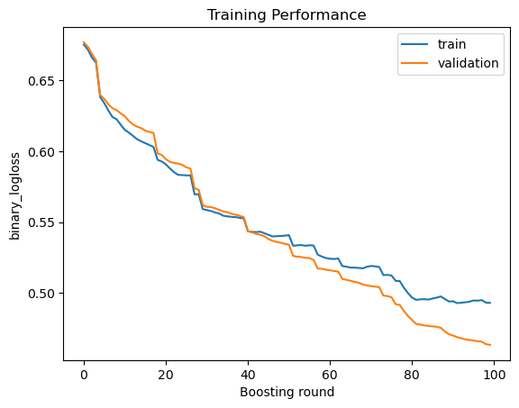
    


```python
plot_eval_metrics(evals_result['train']['auc'], evals_result['validation']['auc'], 'auc', 'AUC')
```


    
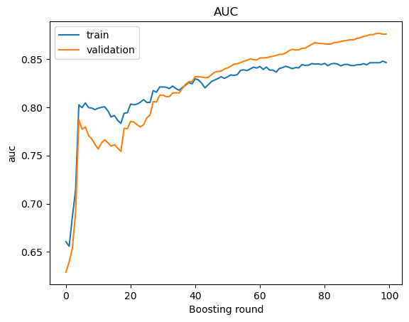
    


### XGB H.PARAMS TUNING


```python
# import xgboost as xgb

# def train(trial):
#     param = {
#         'objective': 'binary:logistic',
#         'eval_metric': ["auc", 'logloss'],
#         'eta': trial.suggest_float('eta', 0.01, 0.3),
#         'tree_method': "hist", 
#         'max_depth': trial.suggest_int('max_depth', 6, 15),
#         'subsample': trial.suggest_float('subsample', 0.1, 1.0),          
#         'colsample_bytree': trial.suggest_float('colsample_bytree', 0.1, 1.0),
#         'grow_policy': trial.suggest_categorical('grow_policy', ['depthwise', 'lossguide']),
#         'learning_rate'   :trial.suggest_loguniform('learning_rate', 1e-8, 1.0),
#         'alpha': trial.suggest_float('alpha', 1e-8, 1.0),
#         'lambda': trial.suggest_float('lambda', 1e-8, 1.0),   
#         'gamma': trial.suggest_float('gamma', 1e-8, 1.0),
#         'min_child_weight': trial.suggest_int('min_child_samples', 1, 10),
#         'max_delta_step': trial.suggest_int('max_delta_step', 0, 10),
#         'scale_pos_weight': trial.suggest_float('scale_pos_weight', 0.1, 10),
#         'tree_method': trial.suggest_categorical('tree_method', ['auto', 'exact', 'approx', 'hist']),
#         'min_split_loss': trial.suggest_float('min_split_loss', 1e-8, 1.0)
#     }

#     skf = StratifiedKFold(n_splits=5, shuffle=True, random_state=42)
#     for fold_id, (train_idx, val_idx) in enumerate(skf.split(X, y)): 
#         X_train, X_val = X.iloc[train_idx], X.iloc[val_idx]
#         y_train, y_val = y.iloc[train_idx], y.iloc[val_idx]
#         x_tr = xgb.DMatrix(X_train, y_train)
#         x_eval = xgb.DMatrix(X_val, y_val)
#         evals = [(x_tr, "train"), (x_eval, "validation")]
#         xgb_model = xgb.train(params=param, dtrain=x_tr, evals = evals, verbose_eval = 0, num_boost_round=1000, early_stopping_rounds= 10)

#         preds = np.rint(xgb_model.predict(x_eval))
#         accuracy = accuracy_score(y_val, preds)
#         return accuracy

# study_xgb = optuna.create_study(direction="maximize")
# study_xgb.optimize(train, n_trials=100)
```


```python
study_xgb = {
    'best_params': {
        'eta': 0.1235172503576541,
        'max_depth': 11,
        'subsample': 0.4326739886890928,
        'colsample_bytree': 0.9195802174469211,
        'grow_policy': 'lossguide',
        'learning_rate': 0.0036815150618710974,
        'alpha': 0.5131969241037851,
        'lambda': 0.049710604023600724,
        'gamma': 0.016091257152274663,
        'min_child_samples': 3,
        'max_delta_step': 4,
        'scale_pos_weight': 1.3669766284368359,
        'tree_method': 'approx',
        'min_split_loss': 0.2612907311709575
    }
}
```

### TRAINING XGB CLASSIFIER


```python
xgb_params = {
    'objective': 'binary:logistic',
    'eval_metric': ["auc", 'logloss'],
    **study_xgb['best_params']
    }
eval_results={}
skf = StratifiedKFold(n_splits=5, shuffle=True, random_state=42)
for fold_id, (train_idx, val_idx) in enumerate(skf.split(X, y)): 
    X_train, X_val = X.iloc[train_idx], X.iloc[val_idx]
    y_train, y_val = y.iloc[train_idx], y.iloc[val_idx]
    x_tr = xgb.DMatrix(X_train, y_train)
    x_eval = xgb.DMatrix(X_val, y_val)
    evals = [(x_tr, "train"), (x_eval, "validation")]
    xgb_model = xgb.train(params=xgb_params, dtrain=x_tr, evals = evals, evals_result=eval_results, verbose_eval = 0, num_boost_round=1000, early_stopping_rounds= 10)
```

    [06:33:03] WARNING: ../src/learner.cc:627: 
    Parameters: { "min_child_samples" } might not be used.
    
      This could be a false alarm, with some parameters getting used by language bindings but
      then being mistakenly passed down to XGBoost core, or some parameter actually being used
      but getting flagged wrongly here. Please open an issue if you find any such cases.
    
    
    [06:33:10] WARNING: ../src/learner.cc:627: 
    Parameters: { "min_child_samples" } might not be used.
    
      This could be a false alarm, with some parameters getting used by language bindings but
      then being mistakenly passed down to XGBoost core, or some parameter actually being used
      but getting flagged wrongly here. Please open an issue if you find any such cases.
    
    
    [06:33:17] WARNING: ../src/learner.cc:627: 
    Parameters: { "min_child_samples" } might not be used.
    
      This could be a false alarm, with some parameters getting used by language bindings but
      then being mistakenly passed down to XGBoost core, or some parameter actually being used
      but getting flagged wrongly here. Please open an issue if you find any such cases.
    
    
    [06:33:24] WARNING: ../src/learner.cc:627: 
    Parameters: { "min_child_samples" } might not be used.
    
      This could be a false alarm, with some parameters getting used by language bindings but
      then being mistakenly passed down to XGBoost core, or some parameter actually being used
      but getting flagged wrongly here. Please open an issue if you find any such cases.
    
    
    [06:33:30] WARNING: ../src/learner.cc:627: 
    Parameters: { "min_child_samples" } might not be used.
    
      This could be a false alarm, with some parameters getting used by language bindings but
      then being mistakenly passed down to XGBoost core, or some parameter actually being used
      but getting flagged wrongly here. Please open an issue if you find any such cases.
    
    


```python
plot_eval_metrics(eval_results['train']['logloss'], eval_results['validation']['logloss'], 'logloss', 'Training Performance')
```


    
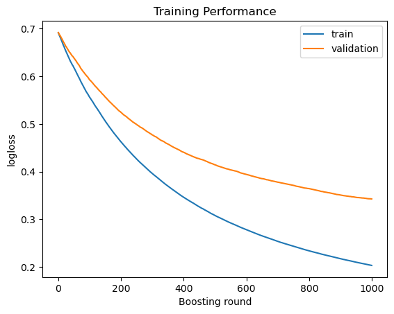
    


```python
plot_eval_metrics(eval_results['train']['auc'], evals_result['validation']['auc'], 'auc', 'AUC')
```


    
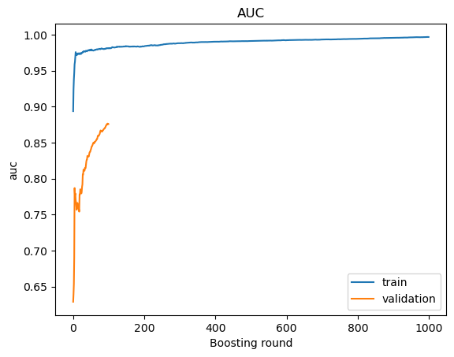
    


```python
import pickle

pickle.dump(xgb_model, open('/kaggle/working/xgb_v1.pickle', "wb"))
pickle.dump(lgb_model, open('/kaggle/working/lgbm_v1.pickle', "wb"))
```

### FEATURE IMPORTANCE


```python
importance = xgb_model.get_score(importance_type= "gain")
features = list(importance.keys())
values = list(importance.values())
fig, ax = plt.subplots(figsize =(10, 7))

ax.set_title("Feature Importance Chart")
plt.pie(values, labels=features, autopct = lambda pct: "{:.1f}%".format(pct))
plt.show()
```


    
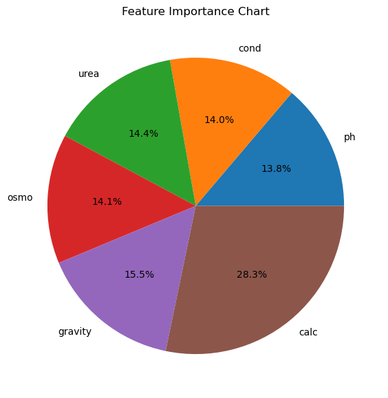
    


# SUBMISSION

We should not forget to transform test input same as how we transformed the training data.


```python
transformed_test = pd.DataFrame()

qt_columns = ['urea', 'osmo', 'gravity', 'calc' ]
pt_columns = ['ph', 'cond']

for i, column in enumerate(pt_columns):
    pt = PowerTransformer(method="yeo-johnson").fit_transform(test_ds[column].values.reshape(-1, 1))
    transformed_test[column] = pd.DataFrame(pt)
for i, column in enumerate(qt_columns):
    tf = QuantileTransformer().fit_transform(X=test_ds[column].values.reshape(-1, 1))
    transformed_test[column] = pd.DataFrame(tf)
for i, column in enumerate(pt_columns):
    pt = RobustScaler().fit_transform(test_ds[column].values.reshape(-1, 1))
    transformed_test[column] = pd.DataFrame(pt)
```

    /opt/conda/lib/python3.7/site-packages/sklearn/preprocessing/_data.py:2593: UserWarning: n_quantiles (1000) is greater than the total number of samples (276). n_quantiles is set to n_samples.
      "n_samples." % (self.n_quantiles, n_samples)
    /opt/conda/lib/python3.7/site-packages/sklearn/preprocessing/_data.py:2593: UserWarning: n_quantiles (1000) is greater than the total number of samples (276). n_quantiles is set to n_samples.
      "n_samples." % (self.n_quantiles, n_samples)
    /opt/conda/lib/python3.7/site-packages/sklearn/preprocessing/_data.py:2593: UserWarning: n_quantiles (1000) is greater than the total number of samples (276). n_quantiles is set to n_samples.
      "n_samples." % (self.n_quantiles, n_samples)
    /opt/conda/lib/python3.7/site-packages/sklearn/preprocessing/_data.py:2593: UserWarning: n_quantiles (1000) is greater than the total number of samples (276). n_quantiles is set to n_samples.
      "n_samples." % (self.n_quantiles, n_samples)


```python
transformed_test = transformed_test.reindex(['ph', 'cond', 'urea', 'osmo', 'gravity', 'calc'], axis=1)
test_xgb = xgb.DMatrix(transformed_test)
lgbm_pred = lgb_model.predict(transformed_test)
xgb_pred = xgb_model.predict(test_xgb)
```


```python
ensembled_prediction = (0.5*xgb_pred)+(0.5*lgbm_pred)
```


```python
# ids = pd.read_csv("/kaggle/input/playground-series-s3e12/test.csv")['id']
# submission = pd.DataFrame(data={'id': ids, 
#                                 'target': ensembled_prediction})
# submission.to_csv('submission.csv', index=False)
```
